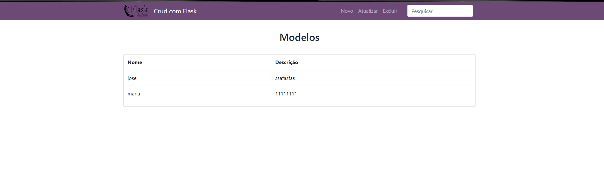
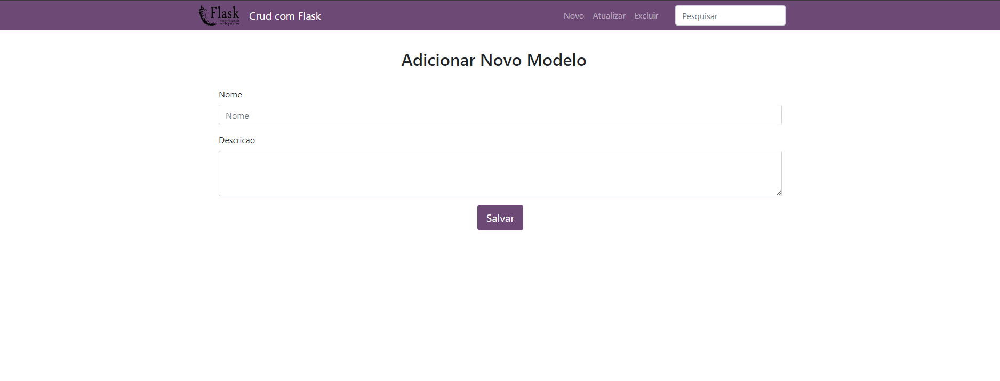

# Crud com Flask

Esse exemplo básico foi feito com o intuito de iniciar os estudos com o framework flask, 
<h2>Funcionalidades</h2>

- Cadastro de um modelo com ```nome``` e ```descrição```
- Lista todos os modelos existentes no banco de dados
- Lista os modelos por ```nome```
- Lista os modelos por ```id```
- Atualiza o modelo por ```nome```
- Deleta o modelo por ```nome```
- Filtro de busca 

<h2>Bibliotecas usadas:</h2>

- flask_replus 
- SQLAlchemy 
- marshmallow


<h2>Instale as depências</h2> 

    pip install -r requirements.txt

<h2>Gerando arquivo de configurações</h2>

- Entre na pasta settings
- Rode o arquivo *env_gen.py*

<h2>Inicializando o app</h2>

    python -m app
    
 ### Tela Principal   

    

### Tela de cadastro de novo modelo
